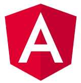
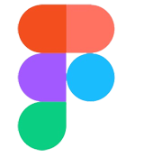
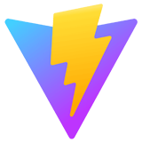

<h1 align="center">
  Hi 
  
  I'm Marcel Lukas
</h1>

    
    

    
    

<h3 align="center">
  My preferred tech stack
</h3>

    
    
    
    
    
    
    
    
    

 
<h3 align="center">
  Continuing to gain experience
</h3>

    
    

  

  <strong>
    Keep coding, stay innovative, and build a better future! ✨
  </strong>

    

